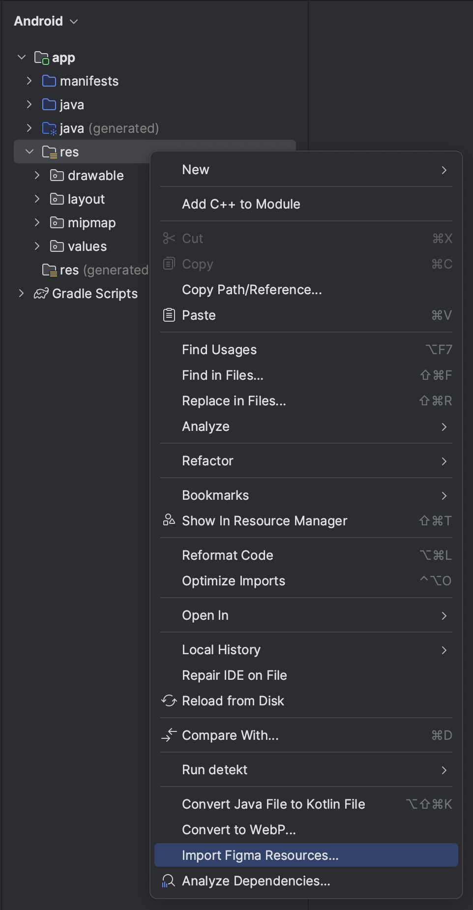
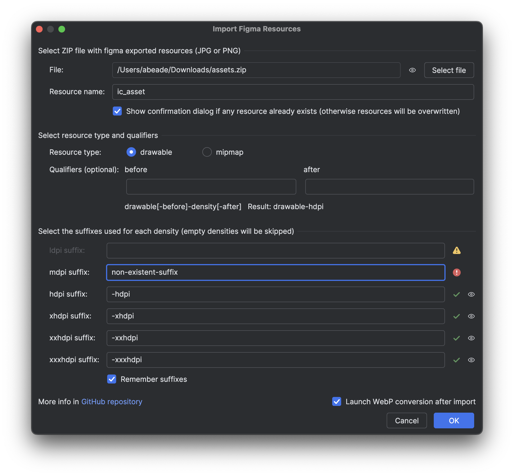
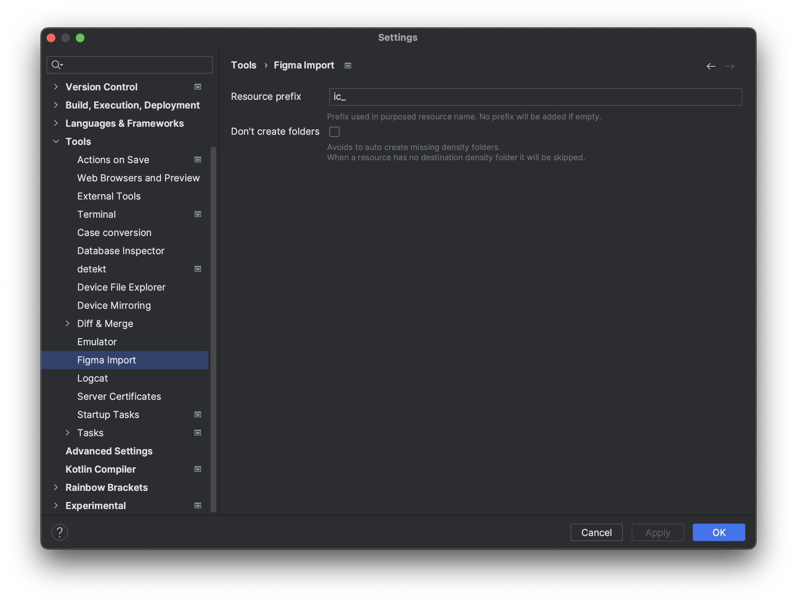

# Figma Import Plugin

<!-- Plugin description -->
Imports figma exported resources ZIP file containing PNG or JPG files by matching its suffixes with density folders
<!-- Plugin description end -->

# Installation
You can install the plugin from the [Plugin Repository](https://plugins.jetbrains.com/plugin/12037-import-figma-resources).

Or you can download the latest binary from [releases](https://github.com/abeade/figma-import-plugin/releases) on this repo

# Usage
The plugin installs one menu entry under the context menu when click over a `res` folder in a project:

When using this option a import dialog will be shown:

In it you need to select the ZIP file, once selected the purpose resource name will be filled (you can change it if you need it) and matched and not matched suffixes will show an icon on right side.

The "Remember suffixes" check allows to store the given suffixes for next plugin executions.

# Setup
You can change the proposed resource prefix in settings:

